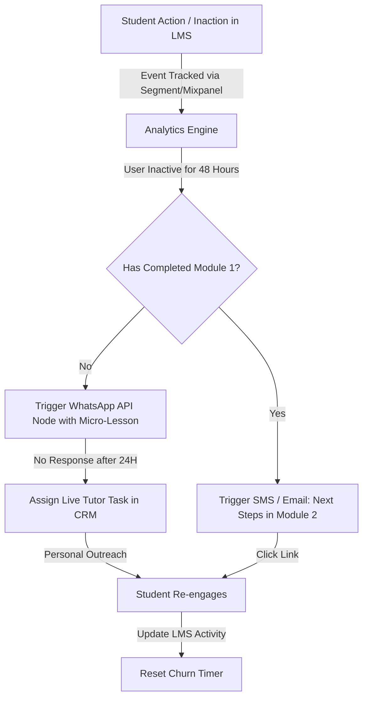

# The E-Learning Churn: How EdTech and Academies Can Stop Student Dropout with Automated Engagement Workflows

The global EdTech market has experienced unprecedented growth, yet beneath the surface of soaring student sign-ups lies a quiet crisis: student churn. B2C e-learning platforms, online academies, and digital bootcamps frequently suffer from dropout rates ranging between 70% and 90% within the first thirty days. In this digital-first learning environment, acquiring a student is only a small victory; keeping them engaged long enough to realize the value of the course is the real challenge.

High customer acquisition costs (CAC) make this student churn extremely costly. If an academy spends $80 on digital ads to acquire a single student, but that student drops out after their first lesson, the academy never recovers its media spend. Over time, high churn rates erode margins, deplete marketing budgets, and lower the lifetime value (LTV) of the customer base.

To survive, EdTech companies must move away from static, transactional student relationships. The answer lies in building automated, event-driven engagement pipelines. By tracking user behavior within the Learning Management System (LMS) and triggering real-time, personalized communication workflows, academies can prevent dropouts, improve course completion rates, and maximize student lifetime value. Partnering with a specialized [growth marketing partner](https://valoradimensions.com/) allows EdTech brands to design and build these retention engines.

---

## The Problem: The High Cost of the Silent Dropout

Unlike traditional physical universities, B2C e-learning platforms suffer from a lack of social accountability. When a student buys an online course, there is no physical campus to visit, no scheduled classroom to sit in, and no professor checking attendance. This self-paced environment, while highly flexible, makes it incredibly easy for students to slip away unnoticed.

This dropout cycle typically follows a predictable timeline:
1. **The Day 1 Cliff:** The student signs up, logs in, completes the introductory video, and feels motivated.
2. **The Day 3 Gap:** The student misses their next scheduled study block. No notification is sent, and the student begins to lose momentum.
3. **The Day 7 Stall:** The student faces a difficult concept or fails a practice quiz. Frustrated and without immediate support, they close the browser tab.
4. **The Day 30 Churn:** The student has not logged in for three weeks. The academy attempts to win them back with a generic, batch-and-blast email newsletter, which is either ignored or sent to the spam folder.

By the time the academy realizes the student has left, the customer relationship is dead. When this drop in engagement is repeated across thousands of students, the business’s financial health suffers. The Customer Acquisition Cost remains fixed, but because the average subscription or installment payment stops, the LTV drops. This creates a leaky funnel where the academy must continuously spend more on ads just to maintain their base revenue.

---

## The Solution: Event-Driven Automation and Personalized Engagement Workflows

To stop student dropouts, EdTech companies must replace static newsletters with event-driven marketing automation. Instead of sending emails on a calendar-based schedule, academies must track student activity in real-time and trigger personalized communications based on what the student does—or fails to do.

This transition requires mapping the student journey into key behavioral triggers. For example, if a student completes a lesson, the system should instantly send a word of encouragement along with a preview of the next chapter. If a student fails a practice quiz, the workflow should immediately trigger an email offering supplementary study guides or a link to a group tutoring session.

Most importantly, if a student is inactive for a specific window—such as 48 hours—the engagement pipeline must intervene automatically. By deploying multi-channel notifications across email, SMS, and WhatsApp, academies can reach students on their preferred channels. To execute this conversion-driven strategy, EdTech brands must work with a [performance marketing agency](https://valoradimensions.com/) that understands both paid media acquisition and deep-funnel CRM integration.

---

## Pipeline Mechanics & Technical Setup: Building the Retention Engine

Creating an automated engagement pipeline requires connecting your LMS with a customer engagement platform (such as HubSpot, ActiveCampaign, Braze, or Customer.io) via webhooks and APIs. Here is the structural flow of an automated retention pipeline:

### Step 1: Event Tracking and Data Collection
The foundation of the pipeline is event tracking. Using a customer data platform like Segment, the academy tracks student interactions within the LMS. Key events include `account_created`, `lesson_started`, `lesson_completed`, `quiz_submitted`, `quiz_score_received`, and `session_ended`.

### Step 2: Automated Inactivity Triggers
The customer engagement platform monitors the time elapsed since the last `session_ended` event. If this value exceeds 48 hours, the contact enters a specialized "Re-Engagement Workflow." The platform dynamically checks the student's progress:
* If the student has completed less than 20% of the course, they are routed to a "Foundations Support" sequence.
* If the student is mid-way through, they receive a "Milestone Motivation" message showing how close they are to graduation.

### Step 3: The WhatsApp Interaction Node
To maximize engagement, the system sends an automated WhatsApp message rather than a standard email. The WhatsApp API node asks a simple, interactive question: *"Hi Sarah, we noticed you paused on Lesson 3. Did you find the coding exercise challenging? Reply with 1 for Yes (and get a video walkthrough) or 2 for No (to schedule your next study reminder)."* Based on the user's response, the chatbot delivers the helpful resource instantly.

### Step 4: The Human-in-the-Loop Backup
If the student remains inactive for 7 days despite automated WhatsApp and email reminders, the system triggers a webhook to the CRM. This creates an automated task for the student success team: *"Sarah has been inactive for 7 days. Action: Send personal SMS/call to offer study support."*

By combining automated, event-driven messaging with timely human touchpoints, the academy can prevent students from falling through the cracks. Building this technical architecture requires partnering with a [B2B digital marketing agency](https://valoradimensions.com/) that specializes in marketing technology and CRM integration.

---

## Case Scenario: ROI, Churn Reduction, and LTV Optimization

To understand the financial impact of automated engagement workflows, let’s review the data from a B2C professional training academy specializing in data science bootcamps. 

Initially, the academy used a standard email sequence consisting of a welcome email, a weekly generic newsletter, and a payment reminder. Their student acquisition cost was $75, and their monthly subscription fee was $49. Because of high dropouts, the average student only remained active for 1.8 months, resulting in an average LTV of $88.20 and an LTV-to-CAC ratio of just 1.18:1. This narrow margin left the academy with virtually no budget to scale their paid campaigns.

The academy partnered with [Valoradimensions](https://valoradimensions.com/) to engineer an event-driven CRM pipeline and deploy WhatsApp-integrated retention workflows. The financial and engagement metrics over the subsequent 6-month cohort analysis showed dramatic improvements:

| Metric | Basic Email Sequence | Automated Engagement Pipeline | Performance Improvement |
| :--- | :--- | :--- | :--- |
| **Average Course Completion Rate** | 12.4% | 58.6% | **+372.5% Increase** |
| **First-Month Student Retention** | 35.0% | 88.0% | **+151.4% Increase** |
| **Average Customer Lifetime (Months)** | 1.8 Months | 6.5 Months | **+261% Customer Retention** |
| **Average Customer Lifetime Value (LTV)** | $88.20 | $318.50 | **+261% Revenue Growth** |
| **Customer Acquisition Cost (CAC)** | $75.00 | $62.00 (optimized via retargeting) | **-17.33% Decrease** |
| **LTV-to-CAC Ratio** | 1.18:1 | 5.13:1 | **4.3x ROI Efficiency** |
| **Monthly Churn Rate** | 36.0% | 11.2% | **-68.8% Churn Reduction** |

With a higher LTV, the academy unlocked the capital needed to scale their paid acquisition channels. By leveraging the data from their highly engaged students, the agency built lookalike profiles on Meta and Google, driving down lead acquisition costs and boosting paid ad conversion rates.

---

## Conclusion: Retention is the Ultimate Growth Lever

In the highly competitive e-learning industry, scaling a business by simply pouring more money into paid ads is unsustainable. If your student onboarding pipeline is broken, increasing your marketing budget will only result in higher customer acquisition spend and empty cohorts. 

Retention is the ultimate growth lever. By tracking student behavior in real-time, building event-driven communication pipelines, and using channels like WhatsApp and SMS to re-engage inactive users, EdTech brands can stop student dropout, boost course completion rates, and maximize long-term profitability.

Structuring, integrating, and optimizing these automated retention workflows requires deep technical marketing expertise. At **Valoradimensions**, we partner with e-learning brands to build conversion-driven growth engines that optimize both customer acquisition and long-term retention. Contact us today to audit your onboarding pipeline and turn your academy into a high-retention growth engine.
