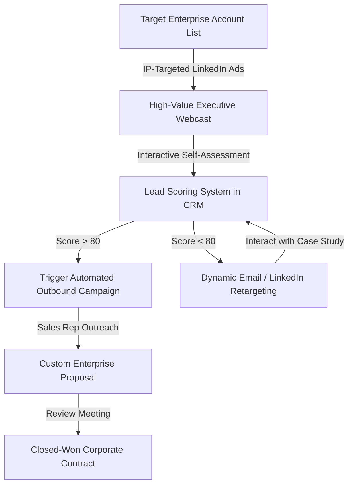

# Selling to Enterprise: The B2B Demand Generation Playbook for Executive Education Academies

For executive education academies and professional development providers, the corporate enterprise sector represents the ultimate revenue stream. Securing a single contract to train an organization’s senior leadership, middle management, or technical staff can yield anywhere from $50,000 to over $250,000 in contract value. However, selling high-ticket educational services to enterprise buyers is a highly complex process. 

Unlike B2C e-learning programs where a single customer makes an instant buying decision, enterprise sales involve long sales cycles, multiple stakeholders, and strict budget reviews. Executive education providers often fail because they treat enterprise acquisition like a standard lead generation campaign. They run broad paid ads to capture email addresses, only to find that senior decision-makers—such as Chief Human Resources Officers (CHROs), Learning & Development (L&D) Directors, and VPs of Talent—rarely fill out generic lead forms.

To win in the enterprise space, academies must transition to a B2B demand generation model. By building authority, deploying Account-Based Marketing (ABM) campaigns, and engineering automated lead nurturing systems, academies can build a predictable pipeline of qualified opportunities. Partnering with a dedicated [B2B digital marketing agency](https://valoradimensions.com/) allows executive education academies to build these high-volume enterprise pipelines. This playbook details how academies can scale their enterprise sales and improve marketing ROI.

---

## The Problem: The Enterprise Decision-Maker Bottleneck

Selling corporate training programs requires navigating a complex purchasing group. In a typical enterprise deal, the buying center includes L&D specialists, department heads, procurement officers, and senior HR executives. Each stakeholder has different concerns: HR focuses on retention and employee engagement, department heads look for direct skill application, and procurement focuses on cost reduction.

The traditional sales process for corporate training is broken in three key areas:
1. **Low-Value Content Capture:** Many academies gate basic content, such as a simple brochure, behind an online form. When a mid-level manager downloads this brochure, the sales team immediately calls them, resulting in a low-value sales conversation because the prospect lacks the authority or budget to make a purchase.
2. **Siloed Marketing and Sales Operations:** Marketing teams are often judged solely on the volume of leads they generate, rather than the revenue those leads produce. This leads to marketing teams driving low-quality leads, while sales representatives struggle to close them.
3. **Long and Unpredictable Sales Cycles:** Without a structured nurturing process, enterprise leads sit in the CRM for months. Academies struggle to keep prospects engaged during these long evaluation periods, allowing competitors to step in and win the contract.

To scale, academies must build a demand generation strategy that builds trust before forcing a sales conversation. They must focus on identifying target accounts and nurturing key decision-makers through a structured journey.

---

## The Solution: Account-Based Marketing and Intent-Driven Demand Generation

To win enterprise contracts, executive academies must replace broad marketing with high-precision Account-Based Marketing (ABM). Instead of targeting the entire internet, academies build a list of target enterprise accounts within specific verticals (such as financial services, technology, or manufacturing) and focus their efforts exclusively on those companies.

By using IP-based tracking tools and intent-data platforms, academies can identify when employees from target accounts visit their website, what topics they research, and how long they spend on key pages. This data allows the marketing team to serve highly personalized ads directly to decision-makers within those target organizations.

Rather than running generic ads, the campaigns focus on high-value educational content that addresses specific enterprise challenges. For example, instead of advertising a "Corporate Leadership Course," the academy runs campaigns focused on "Designing a Post-Merger Leadership Integration Program for Global Teams." This positioning builds immediate authority and positions the academy as a strategic partner.

To implement this ABM strategy successfully, academies must work with a [growth marketing partner](https://valoradimensions.com/) to build, track, and optimize these automated paid acquisition campaigns.

---

## Pipeline Mechanics & Technical Setup: The Enterprise Demand Funnel

An enterprise demand generation pipeline requires close integration between paid media channels, intent-tracking tools, and the sales CRM. Below is the technical setup of a high-converting enterprise demand funnel:

### Step 1: Account Identification and IP-Targeted Ads
The pipeline starts by building a Target Account List (TAL) of 500 enterprise companies in the region. The marketing team uploads this list to LinkedIn Campaign Manager, targeting specific professional titles (e.g., "Director of L&D," "Chief People Officer," "VP Human Resources"). The ads offer access to an exclusive, live executive webcast or a research report detailing talent retention trends.

### Step 2: Interactive Pre-Qualification and Self-Assessments
When a prospect registers for the webcast, they complete a short self-assessment tool: "Enterprise Skill Gap Analyzer." Rather than collecting basic contact details, the tool asks questions about their organization’s current training budget, primary skill gaps, and current team size. This interactive format provides value to the user while qualifying the account for the sales team.

### Step 3: Predictive Lead Scoring Setup
The CRM (HubSpot or Salesforce) uses a lead scoring model to track and evaluate lead activity:
* Downloading an executive brief adds 15 points.
* Visiting the corporate pricing page adds 25 points.
* Attending the live webcast adds 30 points.
* Matching a target job title and target account adds 40 points.

When a lead’s score exceeds 80 points, they are classified as a Marketing Qualified Lead (MQL) and routed to a dedicated enterprise business development representative (BDR) for personalized outreach.

### Step 4: The Sales-Marketing Feedback Loop
Once the BDR initiates outreach, the CRM automatically tracks the progress of the opportunity. If the BDR successfully schedules a discovery call, the lead status updates to Sales Accepted Lead (SAL). If the lead does not convert immediately, they are placed back into a dynamic retargeting campaign, receiving case studies and client testimonials to keep the academy top-of-mind.

By integrating these tools, the academy can align its marketing and sales teams, ensuring sales reps spend their time on warm, high-intent enterprise prospects. Constructing this pipeline requires a [performance marketing agency](https://valoradimensions.com/) that specializes in enterprise CRM customization and ABM execution.

---

## Case Scenario: ROI, Pipeline Acceleration, and Cost Optimization

Let's look at the financial results of this demand generation model, using a case study of an executive business academy offering premium corporate leadership and change management programs. 

Initially, the academy relied on a combination of cold email lists, general SEO, and traditional outbound sales reps. Over a 12-month period, the team generated 450 raw contacts, which resulted in just 4 closed enterprise contracts, worth an average of $65,000 each. The total revenue was $260,000, but the acquisition spend was $95,000. This resulted in a customer acquisition cost of $23,750 per closed contract, and the sales cycle averaged 10.5 months.

To scale their sales, the academy partnered with [Valoradimensions](https://valoradimensions.com/) to build an ABM demand generation engine. The comparison over the next 12 months showed a dramatic shift:

| Metric | Traditional Outbound Sales | Automated ABM Demand Gen | Performance Improvement |
| :--- | :--- | :--- | :--- |
| **Target Enterprise Accounts Identified** | Unstructured | 850 Target Accounts | **Structured Precision** |
| **Sales Opportunities Generated (SQLs)** | 22 | 84 | **+281.8% Increase** |
| **Closed-Won Enterprise Contracts** | 4 | 19 | **+375% Increase** |
| **Average Contract Value (ACV)** | $65,000 | $82,000 (upsells included) | **+26.1% Increase** |
| **Total Generated Revenue** | $260,000 | $1,558,000 | **+499.2% Revenue Growth** |
| **Customer Acquisition Cost (CAC)** | $23,750 | $4,850 | **-79.57% Decrease** |
| **Average Sales Cycle Length** | 10.5 Months | 4.6 Months | **-56.19% Time Saved** |
| **Marketing ROI** | 2.73x | 16.9x | **6.2x ROI Efficiency** |

By focusing their marketing budget on a defined list of high-value accounts, the academy eliminated wasted ad spend. The lead scoring system allowed the sales team to focus their attention on accounts showing real purchase intent, reducing the sales cycle by more than five months and boosting overall contract values.

---

## Conclusion: Dominating the Enterprise Learning Space

For executive education academies, scaling sales is not about generating more clicks—it is about winning high-value corporate contracts. Relying on outbound cold calling or basic lead capture forms results in wasted budget, long sales cycles, and frustrated sales teams.

To scale, academies must build a B2B demand generation model that targets key accounts and nurtures decision-makers with high-value content. By integrating intent tracking with lead scoring and automated sales alerts, academies can shorten their sales cycles, lower acquisition costs, and drive predictable revenue growth.

Building and scaling an enterprise demand generation pipeline requires technical expertise, strategic alignment, and media buying precision. As a performance-first growth partner, **Valoradimensions** specializes in designing and executing end-to-end B2B marketing funnels that deliver enterprise success. Contact us today to audit your current sales pipeline and start winning high-value corporate contracts.
