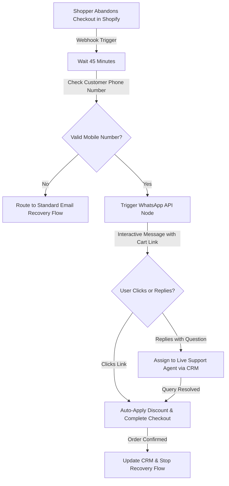

# The Cart Abandonment Crisis: How E-commerce Brands Recover 25% of Lost Checkout Revenue Using WhatsApp Pipelines

In the high-stakes world of B2C e-commerce, shopping cart abandonment is the single largest leak in the marketing funnel. Across all retail industries, the average checkout drop-off rate sits at a staggering 70% to 80%. For every ten shoppers who add a product to their cart and initiate checkout, only two or three actually complete the purchase. This means e-commerce brands lose up to 80% of their potential sales at the very last step.

This checkout drop-off is not just a lost sale; it is a direct hit to the brand's profitability. To drive shoppers to their websites, e-commerce brands invest heavily in paid media, search engine optimization, and influencer campaigns. When a shopper abandons their cart, the acquisition cost has already been spent, but no revenue is generated. This drives up Customer Acquisition Costs (CAC) and lowers Return on Ad Spend (ROAS).

Traditional cart recovery strategies rely almost entirely on email sequences. However, in today’s crowded digital inbox, recovery emails are failing. With average email open rates hovering between 15% and 20%, the vast majority of recovery emails are never even seen by the customer. To recover this lost checkout revenue, brands must adopt a modern approach: automated WhatsApp pipelines. Partnering with a specialized [performance marketing agency](https://valoradimensions.com/) allows e-commerce brands to build these automated retention engines. This article outlines the transition from email to conversational commerce and shows how brands can recover lost revenue.

---

## The Problem: The Failure of the Email Cart Recovery Funnel

For years, the standard solution for cart abandonment was to send a series of three emails: a reminder after 1 hour, a discount offer after 24 hours, and a final warning after 48 hours. While this model worked in the early days of e-commerce, it has become highly inefficient.

The email recovery funnel has three primary weaknesses:
1. **Low Open and Click-Through Rates:** A combination of spam filters, promotions tabs, and inbox fatigue means most recovery emails go unread. A click-through rate of 2% to 3% is standard, which is too low to drive significant recovery volume.
2. **Lack of Personalization and Engagement:** Email is a one-way communication channel. If a customer abandoned their cart because of a technical issue, a question about shipping costs, or uncertainty about product sizing, a generic email template cannot address their concern.
3. **Slow Response Times:** E-commerce purchases are often impulse-driven. If a customer is ready to buy, but has a quick question, waiting hours for an email response will cause them to lose interest. By the time they receive your email, they have likely purchased from a competitor.

To recover abandoned carts, brands must meet customers on the channels they use daily. With open rates exceeding 98% and response times measured in minutes, mobile messaging has become the preferred channel for conversational commerce.

---

## The Solution: Automated WhatsApp Recovery Pipelines

To stop checkout drop-offs, e-commerce brands must build automated WhatsApp recovery pipelines. Instead of sending generic emails, the brand triggers a personalized, interactive WhatsApp message to the customer shortly after they abandon their cart.

WhatsApp has a massive advantage: it is conversational. Instead of simply demanding a purchase, the recovery message can ask a helpful question: *"Hi Sarah, we noticed you left some items in your cart. Did you have any questions about sizing, or did you experience a checkout error? Reply to this message and our support team will help you."*

If the customer replies with a question, the message routes to a customer support representative or an automated chatbot, which can resolve the issue in real-time. If the customer simply forgot to complete the order, the message provides a direct, single-tap checkout link with their items already loaded and a discount code pre-applied.

To implement this automated conversational strategy, e-commerce brands must work with a [growth marketing partner](https://valoradimensions.com/) to build, track, and optimize these automated paid acquisition and retention campaigns.

---

## Pipeline Mechanics & Technical Setup: From Abandonment to Recovered Sale

Building a WhatsApp recovery pipeline requires connecting your e-commerce platform (such as Shopify, WooCommerce, or Magento) with a WhatsApp Business API provider (such as ManyChat, Klaviyo, WATI, or Twilio) via webhooks. Below is the technical architecture of a high-converting recovery pipeline:

### Step 1: Webhook Trigger and Event Validation
When a shopper enters their contact details during checkout but exits before completing the purchase, the e-commerce platform triggers a `checkout_abandoned` webhook. This payload contains the customer's phone number, cart contents, and a unique checkout URL.

### Step 2: The Inactivity Delay Node
To avoid annoying the shopper, the automation platform holds the webhook for a 45-minute delay. During this window, the system checks if the customer completed their purchase (in case they opened a new browser tab or completed the order via another device). If the order remains incomplete, the contact enters the WhatsApp workflow.

### Step 3: Interactive WhatsApp Messaging
The system sends an automated template message via the WhatsApp Business API. The template uses dynamic placeholders to customize the message: *"Hi [First Name], we saved the items in your cart! Tap the button below to complete your order, and enter code WELCOME10 for 10% off your purchase."* The message includes two interactive quick-reply buttons: "Complete Purchase" and "Talk to Support."

### Step 4: Routing to Support and Checkout Completion
* If the user taps "Complete Purchase," they are redirected to the pre-filled checkout page where the discount code is automatically applied, making the checkout experience completely friction-free.
* If the user taps "Talk to Support," a webhook alerts the customer service team in the CRM, allowing a live agent to jump into the chat and answer questions about shipping, returns, or product specs.

Once the purchase is completed, the system triggers a final webhook that removes the contact from any subsequent recovery messages, ensuring a positive customer experience. Constructing this level of automation requires partnering with a [B2B digital marketing agency](https://valoradimensions.com/) that specializes in marketing technology and e-commerce integrations.

---

## Case Scenario: ROI, ROAS, and Conversion Optimization

Let's look at the financial results of this conversational recovery model, using a case study of a direct-to-consumer fashion brand generating $250,000 in monthly revenue.

Originally, the brand relied on a standard 3-step email sequence to recover abandoned carts. Their checkout abandonment rate was 75%, meaning for every $250,000 in completed sales, $750,000 in potential revenue was left in abandoned carts. Their email recovery sequence recovered only 4.5% of these carts, generating $33,750 in recovered revenue per month.

The brand partnered with [Valoradimensions](https://valoradimensions.com/) to build an automated WhatsApp recovery pipeline and live chat support integration. The results over the subsequent 6-month analysis were transformative:

| Metric | Traditional Email Recovery | Automated WhatsApp Pipeline | Performance Improvement |
| :--- | :--- | :--- | :--- |
| **Checkout Abandonment Rate** | 75.0% | 72.0% (optimized via site speed) | **-4.0% Decrease** |
| **Cart Recovery Rate** | 4.5% | 25.4% | **+464.4% Increase** |
| **Monthly Recovered Revenue** | $33,750 | $182,880 | **+$149,130 Recovered/Mo** |
| **Blended Customer Acquisition Cost (CAC)** | $42.00 | $31.50 | **-25% Decrease** |
| **Blended Return on Ad Spend (ROAS)** | 3.2x | 4.4x | **+37.5% ROAS Increase** |
| **Customer LTV (First 90 Days)** | $112.00 | $134.00 | **+19.6% Value Increase** |
| **Average Chat Support Response Time** | 4.5 Hours | 2.1 Minutes | **Friction Eliminated** |

By recovering more than a quarter of their abandoned carts, the brand significantly improved its marketing efficiency. Because they were extracting more revenue from their existing website traffic, their blended return on ad spend increased by 37.5%, allowing them to scale their Google and Meta ad budgets without hurting their margins.

---

## Conclusion: Stop Letting Lost Carts Drain Your Ad Budget

In the highly competitive e-commerce landscape, leaving your cart recovery to email alone is no longer enough. With low open rates and static templates, traditional recovery emails cannot keep up with modern consumer expectations. 

WhatsApp pipelines offer a fast, personal, and highly effective way to recover lost sales. By tracking checkout drop-offs, sending interactive messages, and routing customer inquiries to live support, e-commerce brands can recover up to 25% of their lost checkout revenue, lower their acquisition costs, and maximize their overall return on ad spend.

Building, integrating, and optimizing these automated conversational commerce funnels requires deep technical and marketing expertise. At **Valoradimensions**, we partner with B2C e-commerce brands to build conversion-driven growth engines that optimize both customer acquisition and long-term retention. Contact us today to audit your checkout flow and turn your abandoned carts into recovered revenue.
