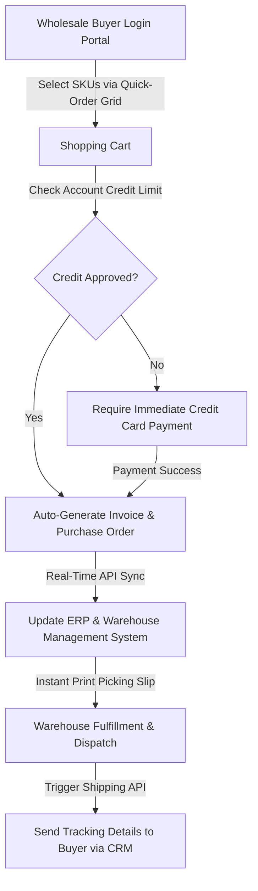

# B2B E-Commerce Scaling: How Manufacturers Build High-Volume Wholesale Ordering Funnels

For manufacturers, industrial suppliers, and wholesale brands, the digital transformation of B2B commerce is no longer a futuristic goal—it is a pressing operational requirement. Historically, B2B wholesale transactions were processed through manual, high-friction channels: sales representatives calling clients to collect orders, buyers filling out complex PDF purchase sheets, and administrative staff manually typing data into Enterprise Resource Planning (ERP) databases. 

While this manual model sufficed when transaction volumes were low, it creates major bottlenecks when scaling. Manual order processing leads to administrative errors, delays in shipment cycles, and high labor costs. Furthermore, modern B2B buyers—who are accustomed to the seamless, self-service shopping experiences of B2C platforms—are increasingly frustrated by the friction of traditional ordering systems. They expect to log in, view their custom pricing tiers, check real-time stock levels, and place high-volume bulk orders in minutes.

To scale their sales without doubling their administrative headcount, manufacturers must transition to automated B2B wholesale ordering funnels. By building self-service digital portals and integrating them directly with backend ERP and inventory systems, manufacturers can streamline operations, eliminate order entry errors, and increase average order values. Partnering with a specialized [growth marketing partner](https://valoradimensions.com/) allows B2B manufacturers to build these high-volume digital acquisition and ordering funnels. This guide details how manufacturers can build scalable B2B e-commerce pipelines.

---

## The Problem: The High Operational Cost of Manual B2B Ordering

Manual B2B sales cycles suffer from three main inefficiencies: high order-processing costs, long fulfillment delays, and a lack of data visibility.

First, processing wholesale orders manually is expensive. When a customer sends a purchase order via email or explains it over a phone call, a sales administrator must review the order, check pricing agreements, confirm stock availability, and type the order into the ERP system. This process is time-consuming and prone to human error. A single misplaced digit in a SKU number or shipping address can lead to returned shipments, chargebacks, and frustrated customers.

Second, manual processing slows down the fulfillment cycle. If an order takes 24 to 48 hours just to be entered into the system, warehouse dispatch is delayed. This lag makes it difficult for manufacturers to offer competitive lead times, driving wholesale buyers to look for faster alternatives.

Finally, manual ordering limits sales volume. Sales representatives spend most of their time on administrative tasks—such as updating client details, checking inventory levels, and tracking shipments—instead of building new commercial relationships. This limit on representative capacity restricts the manufacturer's ability to scale.

---

## The Solution: Self-Service B2B Wholesale Funnels and Portal Customization

To eliminate these operational bottlenecks, B2B manufacturers must build automated wholesale ordering funnels. By deploying dedicated B2B e-commerce portals (using platforms like Shopify Plus B2B, BigCommerce Enterprise, or Adobe Commerce), brands can provide a self-service portal tailored to the unique requirements of wholesale buyers.

Unlike B2C e-commerce websites, a B2B wholesale portal must handle advanced commercial requirements, including:
* **Custom Pricing Tiers:** Automatically display agreed-upon pricing levels for different customer accounts.
* **Volume-Based Discounts:** Dynamically apply discounts based on the quantity of items added to the cart.
* **Flexible Payment Terms:** Support standard B2B payment terms (such as Net 30, Net 60, or bank transfer instructions) based on the customer's credit profile.
* **Bulk SKU Upload Tools:** Allow wholesale buyers to upload a CSV file of SKUs or use a quick-order grid to place orders in seconds.

By providing a modern, self-service digital portal, manufacturers can give wholesale buyers complete control over their ordering process. This digital shift frees up the internal sales team to focus on high-value B2B acquisition and account expansion. To build this strategy, manufacturers must work with a [performance marketing agency](https://valoradimensions.com/) that understands technical system integrations and B2B customer acquisition.

---

## Pipeline Mechanics & Technical Setup: The Enterprise B2B Ordering Engine

A B2B wholesale ordering funnel must connect with backend inventory and accounting systems to automate transactions. Below is the technical architecture of a high-volume B2B e-commerce pipeline:

### Step 1: Secure Customer Authentication and Pricing Assignment
The pipeline starts with a secure login page. When a verified retailer or distributor logs in, the e-commerce engine references their CRM profile to identify their customer tier (e.g., "Bronze," "Silver," "Gold"). The system dynamically updates the catalog prices, displaying their specific contract pricing instead of public retail rates.

### Step 2: The Bulk SKU Ordering Grid
Rather than navigating multiple product pages, B2B buyers use a "Quick Order" page. This interface features a search-and-add grid where buyers search for SKUs, enter quantities, and add dozens of distinct products to their cart simultaneously. The portal also features a CSV upload tool, allowing buyers to export a purchase list from their own inventory system and upload it to the portal to build their order instantly.

### Step 3: API-Driven Credit and Inventory Validation
When the buyer clicks "Place Order," the portal executes two real-time API queries:
* **ERP Inventory Check:** Confirms that the warehouse has the required quantities. If stock is low, the portal offers a backorder delivery option or suggests an alternative SKU.
* **Credit Limit Verification:** Confirms that the buyer's outstanding balance is within their approved credit limit. If the credit check passes, the order is finalized with "Pay on Account" terms. If the account is over its limit, the system prompts the buyer to pay via credit card or wire transfer to complete the transaction.

### Step 4: Automated Warehouse Dispatch and Tracking
Once validated, the order details sync with the Warehouse Management System (WMS). The picking slip prints automatically at the local warehouse, and the stock is reserved. As the order is packed and dispatched, the system triggers a shipping API (such as ShipStation or FedEx API), sending tracking numbers and shipping notifications to the buyer via the CRM.

By automating this sequence, manufacturers can process wholesale orders in minutes, compared to the traditional 2-day manual cycle. Building this level of integration requires a [growth marketing partner](https://valoradimensions.com/) that understands B2B enterprise software and marketing automation.

---

## Case Scenario: ROI, Efficiency gains, and Order Volume Scaling

Let's review the operational and financial impact of this self-service wholesale model, using data from a manufacturer of commercial packaging products and supplies.

Originally, the manufacturer relied on 8 customer service representatives to process wholesale orders received via email, phone, and PDF attachments. The team handled 480 orders per month, with an average order processing time of 36 hours. The manual data entry error rate was 5.8%, resulting in shipping delays and returns that cost the company thousands of dollars monthly. The average order value (AOV) was $1,200.

The manufacturer partnered with [Valoradimensions](https://valoradimensions.com/) to build an automated B2B e-commerce portal and integrate it with their SAP ERP system. The operational results over the first 12 months were transformative:

| Metric | Manual Order Processing | Automated B2B Portal | Performance Improvement |
| :--- | :--- | :--- | :--- |
| **Wholesale Orders Processed/Mo** | 480 | 1,420 | **+195.8% Volume Increase** |
| **Average Order Processing Time** | 36 Hours | 2.5 Minutes | **Friction Eliminated** |
| **Order Entry Error Rate** | 5.8% | 0.08% | **-98.6% Error Reduction** |
| **Average Order Value (AOV)** | $1,200 | $1,550 (via auto-cross sells) | **+29.1% AOV Increase** |
| **Customer Support Team Overhead** | $32,000/Mo | $11,500/Mo (reallocated) | **-64.06% Cost Savings** |
| **Portal Development ROI** | N/A | 3.8 Months | **Fast Capital Recovery** |
| **Active Wholesale Buyers** | 220 | 580 | **+163.6% Base Growth** |

By moving 85% of their ordering volume to the online portal, the manufacturer significantly reduced their operational costs. The automated cross-selling engine prompted buyers to add complementary SKUs to their orders, boosting AOV by 29.1%. This operational efficiency allowed the sales team to pivot from data entry to proactive client acquisition, helping the manufacturer grow their active wholesale client base by 163.6% without increasing administrative headcount.

---

## Conclusion: Lead the Digital B2B Wholesale Market

In today's fast-paced B2B environment, manufacturers cannot afford to rely on manual, high-friction ordering processes. Relying on phone calls, spreadsheets, and PDF purchase orders leads to errors, delays, and lost business to digital-first competitors.

Automated B2B wholesale ordering funnels provide a scalable, efficient way to manage transactions. By building self-service digital portals, integrating them with backend ERP systems, and automating credit and inventory checks, manufacturers can streamline operations, lower overhead, and drive significant sales growth.

Building, integrating, and optimizing these complex B2B e-commerce funnels requires a combination of technical web development, CRM integration, and performance media buying. As a performance-first digital growth partner, **Valoradimensions** specializes in designing and executing end-to-end B2B marketing funnels that deliver measurable business results. Contact us today to audit your current ordering processes and start building a high-volume wholesale ordering engine.
